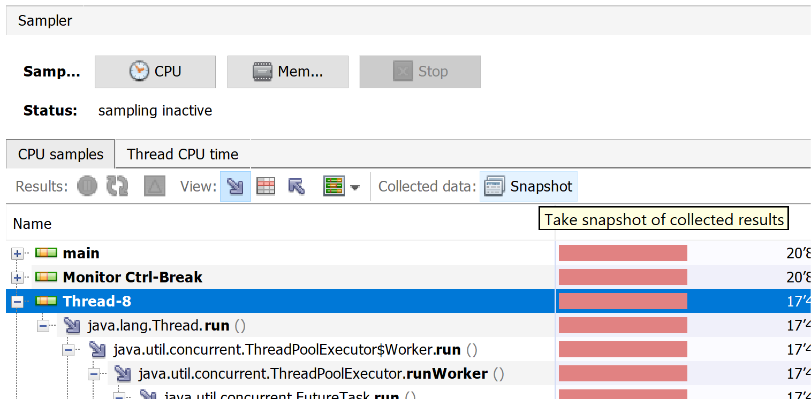

# APM Woche 2: Performance-Optimierung & Profiling

## Vorlesungsfolien

[Performance-Optimierung und Profiling](Performance-Optimierung%20und%20Profiling.pdf)

## Musterlösung Woche 1

Eine Aufgabe von letzter Woche war es, den Doc Finder zu parallelisieren. 
Sie finden _eine mögliche Lösung_ für diese Aufgabe im `solution`-Branch 
dieses Repositories.

## Übung

Als Grundlage für die Übungen dient wieder der Doc Finder. Sie können Ihre 
eigene parallelisierte Version oder die Musterlösung (siehe oben) verwenden.

Das Ziel dieser Übung ist es, die Performance (genauer: die Antwortzeit) des 
Doc Finders weiter zu optimieren. Dafür sollen Sie mittels Profiling 
herausfinden, welche Operationen am meisten Zeit beanspruchen und diese anhand
der in der Vorlesung gezeigten Methodologien oder weiteren Ideen optimieren.

### 1. VisualVM installieren

Ein einfach zu handhabender Profiler für Java-Programme ist
[VisualVM](https://visualvm.github.io/). Es wird/wurde von Oracle entwickelt 
und war früher Teil des Oracle JDKs. In der Zwischenzeit wird das Projekt 
unter einer Open-Source-Lizenz weiterentwickelt.

Laden Sie von der [Download-Seite](https://visualvm.github.io/download.html)
das für Ihr Betriebssystem passende Bundle herunter. Für Windows und Linux 
erhalten Sie eine ZIP-Datei, deren Inhalt Sie an einem beliebigen Ort 
speichern können. Die ausführbare Datei befindet sich im Unterordner 'bin'.

Unter Umständen müssen Sie das zu verwendete JDK konfigurieren. Öffnen Sie 
dazu die Datei 'etc/visualvm.conf' mit einem Texteditor und setzen Sie im 
unteren Teil der Datei die Einstellung `visualvm_jdkhome` auf den Pfad zu 
einem Ihrer installierten JDKs. Sie finden den entsprechendne Pfad zum 
Beispiel in IntelliJ unter _File_ → _Project Structure_ und dann links unter 
_SDKs_. Der erforderliche Pfad entspricht jenem im Feld _JDK home path_.

Starten Sie VisualVM und überprüfen Sie, ob Sie im _Applications_-Teil links 
lokale Java-Programme (z. B. IntelliJ) sehen.

### 2. Performance beobachten

Um die Performance des Doc Finders im Detail zu analysieren, können Sie wieder 
den `DocFinderPerfTester` verwenden, welcher wiederholt Anfragen an den Doc 
Finder stellt. Stellen Sie die Anzahl Wiederholungen auf eine genügend 
grosse Zahl, sodass Sie die Ausführung in Ruhe beobachten können.

Starten Sie den `DocFinderPerfTester` und verbinden Sie sich in VisualVM mit 
dem Programm. Verwenden Sie die beiden Tabs _Monitor_ und _Threads_ um sich 
einen Überblick über die Performance des Doc Finders zu verschaffen.

Versuchen Sie, folgende Fragen zu beantworten:
* Wird die CPU vollständig ausgelastet? Wie ändert sich die CPU-Auslastung, 
  wenn mehr oder weniger Threads für die Parallelisierung des Doc Finders 
  verwendet werden?
* Wie gross ist der Heap, auf dem die Java-Objekte alloziert werden? Ist die 
  Grösse angemessen? Wie aktiv ist der Garbage Collector?
* In welchem Zustand befinden sich die Threads grösstenteils? Gibt es 
  Unterschiede zwischen dem _main_-Thread und den Threads für die 
  Parallelisierung (z. B. aus einem Threadpool)? Falls Threads blockiert 
  sind (Zustand _Wait_, _Park_ oder _Monitor_), aus welchem Grund?

### 3. Profiling

Verwenden Sie den _Sampler_-Tab, um ein CPU-Profil des Doc-Finder-Codes zu 
erstellen. Beachten Sie, wie VisualVM die Begriffe "Sampling" und "Profiling" 
verwendet:
* **Sampling:** Erstellen eines Profils durch Auslesen des Programmzustands
  (z. B. Call Stack) in regelmässigen Abständen. Die Sampling-Frequenz kann 
  rechts bei _Settings_ festgelegt werden. Oft wird diese Technik auch 
  einfach "Profiling" genannt.
* **Profiling:** Erstellen eines Profils durch Aufzeichnen sämtlicher
  Methodenaufrufe. Diese Technik wird oft "Tracing" genannt.

Lassen Sie den Sampler für einige Sekunden laufen und analysieren Sie dann 
das erstellte Profil. Versuchen Sie folgende Fragen zu beantworten:
* Welche Teile des Codes sind für den grössten Teil der Antwortzeit
  verantwortlich?
* Stellen Sie Unterschiede im Profil fest, wenn Sie die Sampling-Frequenz auf 
  einen sehr grossen oder sehr kleinen Wert ändern?
* Beinflusst das Sampling die Performance des Doc Finders? Probieren Sie 
  auch hier verschiedene Sampling-Frequenzen aus.
* Vergleichen Sie die Sampling-Profile auch mal mit den Profilen, welche der 
  _Profile_-Tab durch Tracing liefert. Wie stark beinflusst das Tracing die 
  Performance des Doc Finders?

### 4. Performance-Optimierung

Versuchen Sie aufgrund der Analyse mit VisualVM die Performance des Doc 
Finders zu optimieren. Orientieren Sie sich an folgenden Fragen:
* Welche Operationen dauern am längsten? Sind diese unbedingt nötig? Kann 
  man den gleichen Effekt auf effizientere Art erreichen?
* Gibt es Operationen, welche unnötigerweise mehrfach gemacht werden? Wie 
  kann man diese Mehrfachberechnungen eliminieren?
* Gibt es eine Möglichkeit, Resultate zwischenzuspeichern? Unter welchen 
  Annahmen? Kann man ein "bisschen Korrektheit" für Performance opfern?

Gehen Sie iterativ vor, d. h. versuchen Sie die Performance schrittweise zu 
verbessern. Wenn Sie eine Verbesserung umgesetzt haben, messen Sie die neue 
Performance und notieren Sie den Gewinn. Profilieren Sie das Programm 
dann erneut und suchen Sie nach weiteren Optimierungsmöglichkeiten. Sie 
können Profile auch abspeichern und mehrere Profile miteinander vergleichen! 
Verwenden Sie dazu die _Snapshot_-Funktion:

Bereiten Sie für die nächste Lektion eine kleine Zusammenfassung vor mit den 
wichtigsten Erkenntnissen, kurzen Beschreibungen der vorgenommenen 
Optimierungen und den entsprechenden Performance-Gewinnen.