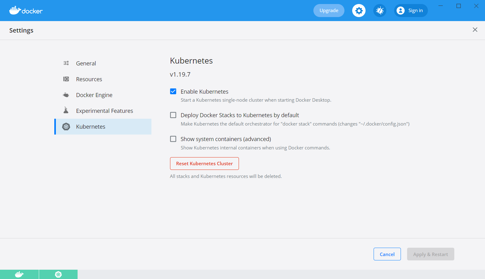

# APM Woche 14: Performance-Management & Autoscaling

[Vorlesungsfolien](Performance%20Management%20und%20Autoscaling.pdf)

## Übung

In den vergangenen Übungen haben Sie eine einfache Key–Value-Store App mit
Docker containerisiert, mit NGINX skaliert und hochverfügbar gemacht, um
einen Clusterspeichersystem erweitert und ihre Performance mittels JMeter
analysiert. In dieser letzten Übung sollen Sie die Applikation in einen
[Kubernetes-Cluster](https://kubernetes.io/docs/concepts/overview/)
deployen und automatisch skalieren lassen.

### 1. Kubernetes aufsetzen

Kubernetes ist ein Open-Source-System zum "Orchestrieren" von
Container-basierten Anwendungen. Mittels einer Konfigurationsdatei gibt man
an, welche Container (und wie viele davon) man braucht, und Kubernetes
kümmert sich darum, diese Container auf den verfügbaren Rechnern zu
verteilen, zu vernetzen und im Fall eines Versagens automatisch wieder zu
starten. Kubernetes bietet auch Loadbalancing und, für das Thema dieser Woche
interessant, automatische Skalierung von Containern basierend auf
Performance-Metriken wie CPU-Auslastung.

Wenn Sie Docker Desktop verwenden (wie in einer früheren Übung empfohlen),
können Sie Kubernetes mit einem Klick in den Einstellungen aktivieren:

Falls Kubernetes unter Windows nicht startet, folgen Sie den Anweisungen in
dieser [Antwort auf Stackoverflow](https://stackoverflow.com/a/57711650/1374678).
Diese vorkonfigurierte Version von Kubernetes enthält nur einen einzigen
*Node*, der Rechner, auf dem Docker installiert ist. Kubernetes verwaltet
normalerweise mehrere Nodes, aber für einfache Experimente reicht dieses
1-Node-Setup.

Sie interagieren mit Kubernetes mittels des Kommandozeilenbefehls `kubectl`.
Geben Sie z. B. folgenden Befehl ein, um alle Nodes anzuzeigen:

    kubectl get nodes

Sie sollten eine Ausgabe ähnlich wie diese erhalten:

    NAME             STATUS   ROLES    AGE    VERSION
    docker-desktop   Ready    master   30s    v1.19.7

Statt `kubectl` können Sie für die meisten Dinge auch die
Kubernetes-Integration von IntelliJ verwenden. Gehen Sie dafür in den
Einstellungen auf "Plugins", wechseln Sie oben auf "Marketplace" und suchen Sie
nach "Kubernetes". Installieren Sie das Plugin von JetBrains und starten Sie
IntelliJ neu. Jetzt sollten Sie im "Services"-Tab unten einen Eintrag für
"docker-desktop" sehen.

### 2. App auf Kubernetes deployen

Um die Key–Value-Store-App auf Kubernetes zu deployen, muss sie als 
Docker-Image zur
Verfügung stehen. Bisher haben Sie die verschiedenen Docker-Images
wahrscheinlich grösstenteils mittels Docker Compose erstellt, wodurch sie
unter einem von Compose generierten Namen gespeichert wurden, z. B.
'key-val-store_web-app'. Um den Namen selber zu bestimmen, greifen Sie auf
folgenden Docker-Befehl zurück, den Sie im Haupt-Ordner des Projekts ausführen:

    docker build -t key-val-store .

Um eine App zu deployen, erstellen Sie eine Kubernetes-YAML-Datei. Erstellen
Sie eine Datei namens 'key-val-store.yml' in einem neuen Ordner 'kubernetes'.
Kopieren Sie folgenden Inhalt rein:

    apiVersion: apps/v1
    kind: Deployment
    metadata:
      name: key-val-store
    spec:
      selector:
        matchLabels:
          app: key-val-store
      replicas: 2
      template:
        metadata:
          labels:
            app: key-val-store
        spec:
          containers:
            - name: key-val-store
              image: key-val-store
              imagePullPolicy: Never

Diese Konfiguration beschreibt ein Kubernetes-"Deployment", welches aus
einer Sammlung von gleichartigen "Pods" besteht. Ein Pod ist die kleinste
Einheit, welche Kubernetes "orchestriert" und kann aus einem oder mehreren
Containern bestehen. In diesem Fall werden zwei Pods erstellt (`replicas: 2`).
Die Definition dieser Pods befindet sich im `template`-Teil und legt fest,
dass ein Container mit dem zuvor erstellten Image 'key-val-store' gestartet wird.
Die Option `imagePullPolicy: Never` ist nötig, da dieses Image nur lokal
gespeichert ist und nicht heruntergeladen werden soll (z. B. von
[Docker Hub](https://hub.docker.com/)).

Sie können dieses Deployment mit folgendem Befehl starten (dazu müssen Sie
sich im selben Ordner wie die Datei befinden):

    kubectl apply -f key-val-store.yaml

Mit folgenden Befehlen können Sie die gestarteten Pods auflisten:

    kubectl get pods

Sie sollten eine Ausgabe wie diese erhalten:

    NAME                            READY   STATUS    RESTARTS   AGE
    key-val-store-cdd866ddf-cdstf   1/1     Running   0          11s
    key-val-store-cdd866ddf-cqpb7   1/1     Running   0          12s

Um die Logs der Applikation anzuzeigen, verwenden Sie folgenden Befehl und
ersetzen den Pod-Namen mit einem vorher angezeigten:

    kubectl logs key-val-store-cdd866ddf-cdstf

Sie sollten die bekannte Ausgabe von Spring Boot sehen. Die beiden Instanzen
sollten sich auch gegenseitig gefunden haben und dem gleichen Hazelcast-Cluster
beigetreten sein (siehe [Übung 11](../week-11)). Die App-Instanzen laufen in
normalen Docker-Containern, welche mit dem bekannten Docker-Befehl angezeigt
werden können:

    docker ps

Allerdings ist die App von ausserhalb von Kubernetes noch nicht erreichbar.
Dieses Problem werden Sie im nächsten Schritt angehen. Um das Deployment zu
beenden, geben Sie einen der folgenden Befehle ein. Der zweite Befehl wird
in den folgenden Übungen nützlich sein, weil er nicht nur das Deployment,
sondern auch alle weiteren in der Datei definierten "Objekte" löscht (siehe
nächster Schritt).

    kubectl delete deployment key-val-store
    kubectl delete -f key-val-store.yaml

Zur Erinnerung: Falls Sie das IntelliJ-Plugin verwenden, finden Sie Pods,
Deployments und viele weitere Dinge im "Services"-Tab. (Allerdings müssen Sie
diese ab und zu refreshen.)

### 3. App öffentlich zugänglich machen

Mit der bisherigen Konfiguration sind die beiden App-Server bereits im
internen Kubernetes-Netzwerk erreichbar (sonst hätten sich die beiden
Hazelcast-Instanzen nicht gefunden), aber von aussen ist noch kein Zugriff
möglich. Dafür braucht es ein weiteres Kubernetes-Objekt vom Typ "Service".
Ein Service nimmt externe Anfragen an einen bestimmten Host-Port entgegen und
leitet sie an einen bestimmten Pod weiter.

Erweitern Sie die YAML-Datei indem Sie folgenden Text hinzufügen:

    ---
    apiVersion: v1
    kind: Service
    metadata:
      name: key-val-store
    spec:
      selector:
        app: key-val-store
      type: LoadBalancer
      ports:
        - port: 8080

Beachten Sie die drei Striche `---`; diese trennen mehrere Kubernetes-Objekte
innerhalb einer Datei voneinander. Diese Konfiguration erstellt einen
Service vom Typ 'LoadBalancer', welcher die Anfragen in einer
Round-Robin-Manier an jene Pods weiterleitet, welche durch den `selector`
definiert sind. In diesem Fall sind das alle Pods mit dem Label `app: key-val-store`,
was auf die im Deployment definierten Pods zutrifft.

Nach einem erneuten `kubectl apply -f key-val-store.yaml` sollten Sie die App unter
[localhost:8080](http://localhost:8080) erreichen können. Beachten Sie den
angezeigten Hostnamen. Wenn Sie die Seite wiederholt neu laden, sollten Sie
irgendwann auch mal auf dem zweiten Server landen. Halten Sie die Reload-Taste
(z. B. F5) gedrückt, um das Ganze zu beschleunigen.

### 4. Autoscaling

Zum Schluss sollen Sie die App automatisch skalieren lassen, d. h. bei Bedarf
automatisch zusätzliche Pods starten und in den Cluster integrieren. Dafür
brauchen Sie ein weiteres Kubernetes-Objekt, vom Typ 'HorizontalPodAutoscaler'.
Dieser Autoscaler holt sich regelmässig Performance-Metriken der laufenden
Pods und entscheidet aufgrund einer konfigurierten Policy, ob zusätzliche
Pods nötig sind oder ob Pods entfernt werden können. Die Details zum
Algorithmus finden Sie in der
[Dokumentation](https://kubernetes.io/docs/tasks/run-application/horizontal-pod-autoscale/#algorithm-details).

Die Performance-Metriken werden in Kubernetes von einem "Metrics Server" zur
Verfügung gestellt. In gewissen Kubernetes-Umgebungen ist dieser Server
bereits vorkonfiguriert, aber in Docker Desktop fehlt er. Ausserdem ist eine
kleine Anpassung in der Konfiguration nötig. Eine funktionierende Konfiguration
befindet sich in der Datei [metrics-server.yaml](metrics-server.yaml). Falls
Sie diese schon gepullt haben, können Sie sie mit folgendem Befehl deployen:

    kubectl apply -f metrics-server.yaml

Alternativ können Sie auch die URL der Datei auf GitHub angeben:

    kubectl apply -f https://raw.githubusercontent.com/apm-fhnw/apm-fs23/main/week-14/metrics-server.yaml

Jetzt können Sie den Autoscaler konfigurieren. Fügen Sie folgenden Text zu
Ihrer Kubernetes-YAML-Datei hinzu:

    ---
    apiVersion: autoscaling/v2beta2
    kind: HorizontalPodAutoscaler
    metadata:
      name: key-val-store
    spec:
      scaleTargetRef:
        apiVersion: apps/v1
        kind: Deployment
        name: key-val-store
      minReplicas: 1
      maxReplicas: 10
      metrics:
        - type: Resource
          resource:
            name: cpu
            target:
              type: Utilization
              averageUtilization: 60

Damit definieren Sie, dass Sie die Anzahl Replicas (Pods) im Deployment
'key-val-store' automatisch bestimmen möchten, und zwar zwischen zwischen 1 und 10.
Die Metrik, die verwendet wird, ist die CPU-Utilization und der gewünschte
Wert beträgt 60%. Falls der Wert der vorhandenen Pods deutlich darüber oder
darunter liegt, werden Pods hinzugefügt oder entfernt.

Das Verhalten des Autoscalers kann mittels verschiedener Optionen ge-finetune-t
werden. Als Erstes sollten Sie die Zeile `replicas: 2` aus der
Deployement-Konfiguration entfernen; diese ist jetzt nicht mehr nötig. Als
Zweites können Sie den Ressourcen-Verbrauch der Pods konfigurieren, indem
Sie den `containers`-Teil folgendermassen erweitern:

    containers:
      - name: key-val-store
        image: key-val-store
        imagePullPolicy: Never
        resources:
          requests:
            cpu: '1'
          limits:
            cpu: '1'

Die neuen Optionen bedeuten, dass jeder Pod mindestens 1 ganze CPU benötigt
(bzw. anfordert: `requests`) und dass er auch nicht mehr als eine CPU
verwenden darf (`limits`). Den Prozent-Wert, den Sie beim Autoscaler
angegeben haben, bezieht sich auf den `requests`-Wert hier.

Den Autoscaler selber können Sie ebenfalls weiter konfigurieren, z. B. indem
Sie angeben, wie lange er mit dem Hinzufügen oder Entfernen von weiteren Pods
warten soll, nachdem ein neuer Pod gestartet wurde (*Cooldown*). Dies wird mit
folgenden Optionen gesteuert:

    behavior:
      scaleUp:
        stabilizationWindowSeconds: 60
      scaleDown:
        stabilizationWindowSeconds: 60

(Das `behavior`-Element befindet sich auf der gleichen Stufe wie `metrics`).
Werfen Sie einen Blick in die
[Dokumentation](https://kubernetes.io/docs/tasks/run-application/horizontal-pod-autoscale/#support-for-configurable-scaling-behavior)
für weitere Konfigurations-Möglichkeiten.

### 5. Autoscaling-Verhalten analysieren

Wenn Sie diese neue Konfiguration "anwenden" (`apply`), sollte das
Deployment mit 1 Pod starten. Mit folgendem Befehl können Sie sehen, wie
stark die App zurzeit ausgelastet ist, bzw. wie nahe am Zielwert von 60% sie
sich befindet:

    kubectl get hpa

Falls Sie auf einem Unix-System arbeiten, können Sie diese Informationen auch
"beaobachten", indem Sie den `watch`-Befehl verwenden, der die Ausgabe alle
zwei Sekunden aktualisiert. Allerdings aktualisieren sich die Werte des
Autoscalers nur etwa alle 60 Sekunden.

    watch kubectl get hpa

Als letzten Schritt sollen Sie JMeter verwenden, um die Applikation zu
"belasten" und das Scale-out auszulösen. Beginnen Sie langsam, indem Sie
erst mal ein paar duzend Users auf die App loslassen, und beobachten Sie die
von `kubectl` gemeldete Auslastung. Erhöhen Sie danach die Anzahl Benutzer
und beobachten Sie, wie das System und die gemessenen Antwortzeiten reagieren.

Ändern Sie auch mal die Autoscaling-Parameter oder die Ressourcen, die
einzelnen Pods zur Verfügung stehen (z.B. `cpu: '0.2'`). Was passiert, wenn der
Wert für `stabilizationWindowSeconds` sehr klein ist? Und wenn er sehr gross
ist? Denken Sie daran, dass ein guter Wert davon abhängig ist, wie schnell ein
neuer Pod bereit steht, was wiederum davon abhängig ist, wie viel
Rechenleistung zur Verfügung steht. Finden Sie zufriedenstellende Werte?